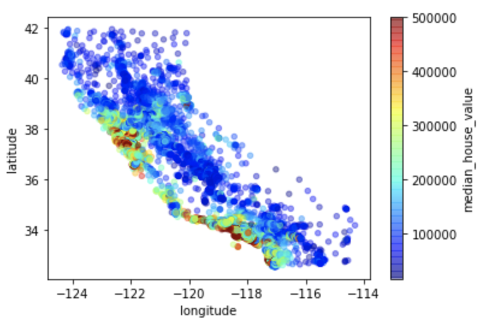

# California House Price Predictor: Project Overview
* **Objective** 
This project aims to build an optimal machine learning model to predict the median house price in any district in California. 
Property investors and real estate agents can benefit from being able to accurately predict and know the trends of house prices. 

* **Walkthrough** 
1. Exploratory Data Analysis  
2. Data Cleaning 
3. Feature Engineering  
4. Fit Machine Learning Models & Compare their performances  
5. Hyperparameter Tuning for Final Machine Learning Model 

* **Coding Language Used**  
Python Version: 3.9 
Packages: pandas, numpy, sklearn, matplotlib, seaborn 

## Exploratory Data Analysis
* The distribution of each feature was checked. Log transformation was done on the skewed features, which made their distributions more normal.  
* The median house prices were visualized by location within California. It could be seen that the prices tend to be higher the closer the houses
  are to the ocean. 
  

  
       

## Data Cleaning

## Feature Engineering 

## Fit Machine Learning Models & Compare their Performances 

## Hyperparameter Tuning for Final Machine Learning Model 
