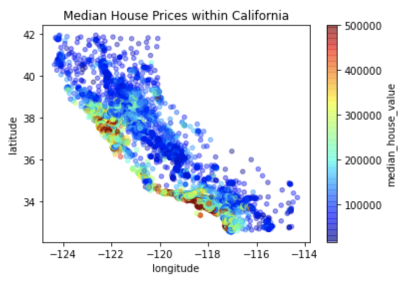
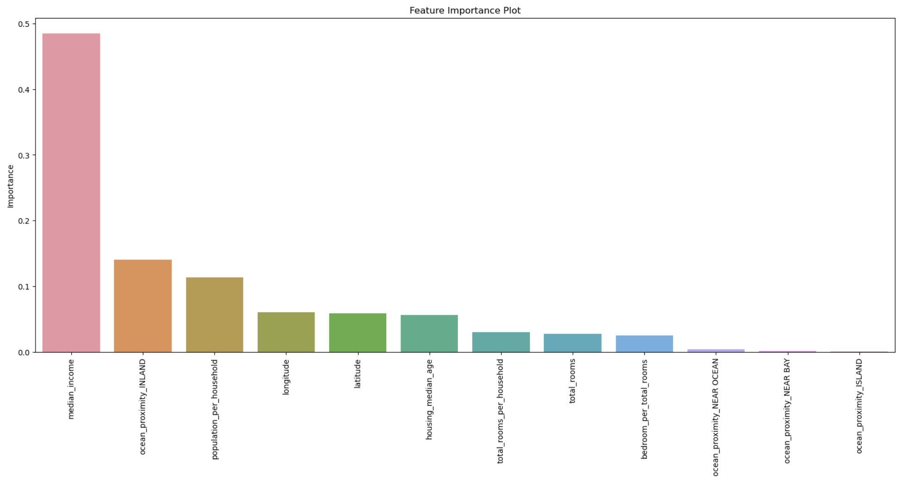

# California House Price Predictor: Project Overview
* **Objective** 
This project aims to build an optimal machine learning model to predict the median house price in any district in California.
Property investors and real estate agents can benefit from being able to accurately predict and know the trends of house prices. 

* **Walkthrough** 
 1. Define the question and collect the data 
 2. Exploratory Data Analysis  
 3. Data Cleaning & Feature Engineering 
 4. Fit Machine Learning Models & Compare their performances  
 5. Hyperparameter Tuning for Final Machine Learning Model 

* **Data& Coding Language Used**  
Data: California Census Data 
Python Version: 3.9 
Packages: pandas, numpy, sklearn, matplotlib, seaborn 

## Exploratory Data Analysis
* The distribution of each feature was checked.  
  Log transformation was done on the skewed features, which made their distributions more normal.  
* The median house prices were visualized by location within California.  
  &#8594; It could be seen that the prices tend to be higher the closer the houses are to the ocean. 
* The median house ages were also visualized by location within California. 
  &#8594; It was apparent that the median ages of most of the houses range from less than 10 to around 30 years throughout California. 
  &#8594; Although the very new houses seemed to be more populated in the lower and middle regions of California, there did not seem to be a 
          noticeable pattern of the median age of houses by location.
  
   

* Median income and the house being inland showed the strongest correlations with the median house prices in the dataset. 
  
## Data Cleaning & Feature Engineering 
* One-hot encoding was done for the categorical variable 
* Missing values were filled with regression imputation using gradient boosting(chosen over linear regression and random forest)
* Heavily correlated features were handled: Redundant and less important features were dropped, and more informative features were created.
* Skewed features underwent log transformation 
* Data were scaled  

## Fit Machine Learning Models & Compare their Performances 
* The data were split into train and test sets with a test size of 20% 
* Five models(Linear Regression, KNN, SVM, Random Forest, Gradient Boosting) were trained with default parameters
* Each model's root mean squared error was compared: Random Forest showed the smallest root mean squared error 

## Hyperparameter Tuning for Final Machine Learning Model 
* The hyperparameters of Random Forest were tuned, which lowered the root mean squared error
* The feature importance plot was created 
 
 
* The root mean squared error and R2 value of the final model were checked with test data 
